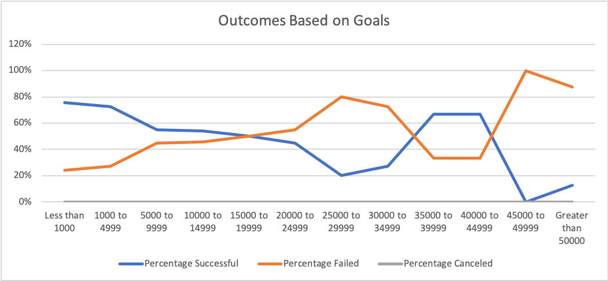

# An Analysis of Kickstarter Campaigns
***Overview***  
This is an analysis of kickstarter data for trends, particularly those in the theatre genre in order to inform client Louise regarding her own kickstarter campaign for her play *Fever* and to inform them of the nature of success of other, similar kickstarter campaigns. 
Prominent analysis reveals trends of Kickstarter Campaign launch dates and goal amounts as indicators of potential success.      
***Report***  
**The Plays Subgenre of Kickstarter Campaigns**  
An analysis of Kickstarter campaigns is not only optimistic regarding campaigns for plays compared to other genres of campaigns, but illuminates multiple key factors that distinguish successful campaigns from their failed counterparts. The visualizations below demonstrate the relatively high number of theatre campaigns compared to other genres and show the majority of these theatre campaigns are indeed successful.  
     
**Indicators of Success**  
Beyond the general success of this subgenre of Kickstarter campaigns, there emerged two key indicators for success among other similar campaigns: Launch date, and Goal amount.  
It is clear that Summer time launch dates tended to bode very well compared to the rest of the year--particularly June. The visualization below shows this trend while backing up the claim that this subgenre is particularly successful as there are more successful than failed campaigns at all times through the year.   
    
The Goal set for the campaigns revealed interesting trends as well. The data strongly suggests a sweetspot for successful Kickstarter campaign goals for this subgenre to be goals set at less than $20k. It is noted, also, that there tend to be successful goals in the range of $35k to $45k.  
    
***Limitations of the Analysis***  
A cheif limitation of this report is that there remains very little context for clarifying why certain characteristics of campaigns tended towards succes or failure. There are also confounding factors that could be very relevant to the concerns of the client that can only be guessed at, such as: demographic of those pledging, socioeconomic levels of the regions of the kickstarter, and the marketing or promotion of the campaigns themselves. For instance, *why* is this subgenre so successful overal compared to other genres? Do Kickstarter algorithms favor certain genres or do certain campaigns naturally tend to be better promoted and thus gain better patronage?    
**Note of Goals Indicator**  
The second range of typically successful plays campaigns of $35k to $45 is weaker than the primary range of less than $20k. There is no way to clarify given the scope of this analysis whether this second range is a good indicator of success or a coincidence due to confounding factors. There is no obvious reason given this scope as to why less than $20k goals tend to work as well as those specfically between $35k and $45k. 
