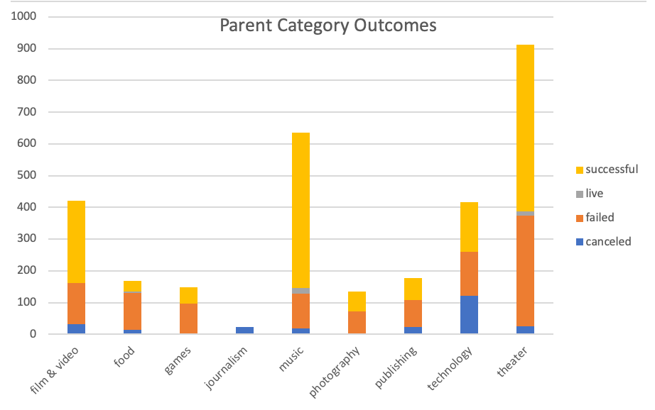
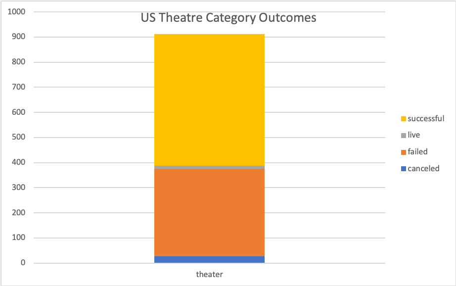
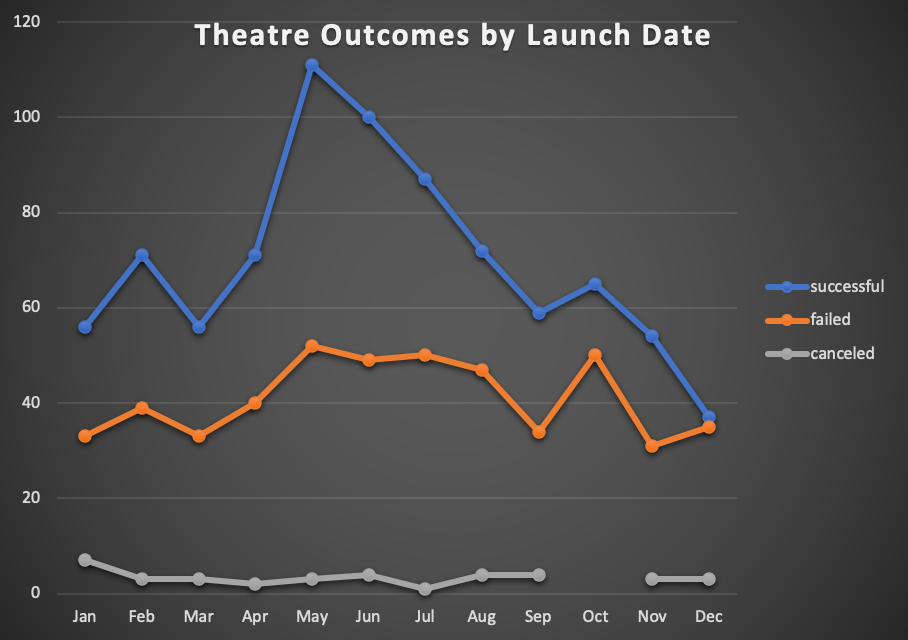

# An Analysis of Kickstarter Campaigns
***Overview***  
This is an analysis of kickstarter data for trends, particularly those in the theatre genre in order to inform client Louise regarding her own kickstarter campaign for her play *Fever* and to inform them of the nature of success of other, similar kickstarter campaigns. 
Prominent analysis reveals trends of Kickstarter Campaign launch dates and goal amounts as indicators of potential success.      
***Report***  
**The Plays Subgenre of Kickstarter Campaigns**  
An analysis of Kickstarter campaigns is not only optimistic regarding campaigns for plays compared to other genres of campaigns, but illuminates multiple key factors that distinguish successful campaigns from their failed counterparts. The visualizations below demonstrate the relatively high number of theatre campaigns compared to other genres and show the majority of these theatre campaigns are indeed successful.  
     
**Indicators of Success**  
Beyond the general success of this subgenre of Kickstarter campaigns, there emerged two key indicators for success among other similar campaigns: Launch date, and Goal amount.  
It is clear that Summer time launch dates tended to bode very well compared to the rest of the year--particularly June. The visualization below shows this trend while backing up the claim that this subgenre is particularly successful as there are more successful than failed campaigns at all times through the year.   

