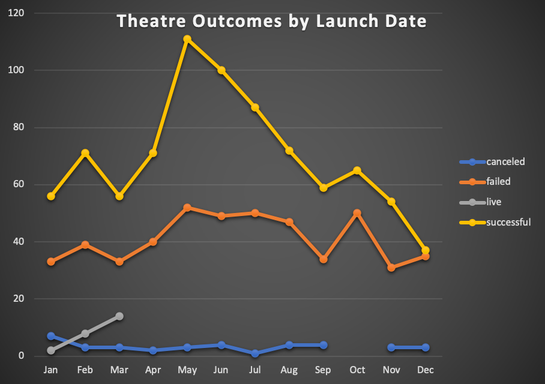
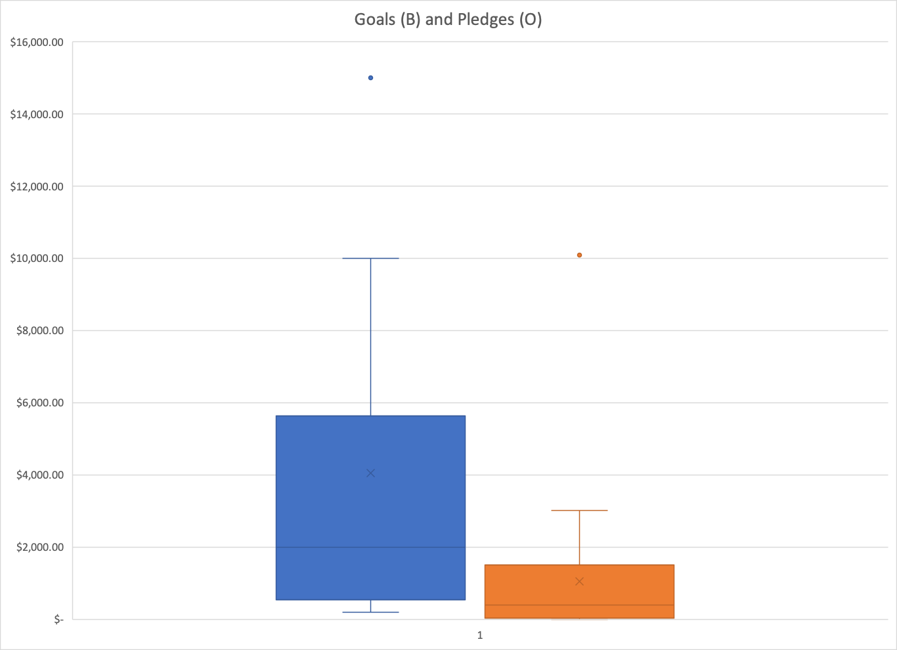

# An Analysis of Kickstarter Campaigns
***Overview***  
This is an analysis of kickstarter data for trends, particularly those in the theatre genre in order to inform client Louise regarding her own kickstarter campaign for her play *Fever* and to inform them of the nature of success of other, similar kickstarter campaigns. 
Prominent analysis reveals trends of Kickstarter Campaign launch dates and goal amounts as indicators of potential success.      
***Report***  
An analysis of Kickstarter campaigns is not only optimistic regarding campaigns for plays compared to other genres of campaigns, but illuminates multiple key factors that distinguish successful campaigns from their failed counterparts. The visualizations below demonstrate the relatively high number of theatre campaigns compared to other genres and show the majority of these theatre campaigns are indeed successful.  
   
More specifically, the month in which a campaign was launched tended to be a strong indicator for its potential success. As depicted, the majority of successful theatre campaigns were launched in the summer months--June in particular.  
    
***Descriptive Statistics***  
 
The scope of Louise's anticipated campaign amount is $4000. The descriptive statistics show that successful US Theatre campaigns tend to have smaller goals. A campaign of $4000 fits nicely into the middle 50% of successful campaigns, slightly above median. The boxplots illustrate the shape, center and spread of the Goals and Pledges for this genre which suggest that we would anticipatet that, all else the same, Louise's campaign is likely to be successful and have many small pledges. 
